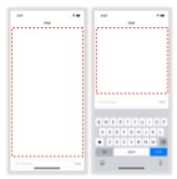
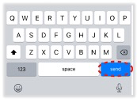
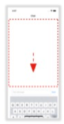

# Xamarin.Forms Chat Experience Prototype
Quick and dirty prototype implementing common user experience requirements for chat-based apps using Xamarin.Forms specifically in relation to the keyboard behavior. 

This was created to quickly explore various approaches and identify opportunities to enhance Xamarin.Forms to reduce the amount of custom platform-specific code required to achieve the same result in future.   

## Indicative Experience
The following behaviors are common to chat experiences across mobile platforms including in the default text messaging applications that ship as part of the OS itself.

1. Having the content area move up (and resize) to accommodate the soft keyboard

    

2. Having the return/send key (on the soft keyboard) invoke some action without dismissing the keyboard

    

3. Preventing specific UI elements from dismissing the keyboard without blocking touch-based input/actions

     

4. Ability to dismiss the soft keyboard by dragging scrollable content downward

    

    **NOTE:** This specific behavior varies between apps and/or platforms. It's common for chat apps on Android to dismiss the keyboard as soon as a drag down gesture is detected whereas on iOS the user must explicitly drag the keyboard out of view but can otherwise scroll content up and down.

Platform-specific code/configuration is required to achieve any of the above behaviors when using Xamarin.Forms. Some of these behaviors are simple to implement and require small amounts of platform-specific code such as points 1 and 2. However, others (points 3 and 4) are more involved and require a larger amount of code to achieve the desired experience.

## Caveats
1. **Current drag to dismiss behavior**   

    I have implemented the drag to dismiss functionlity in a manner that is consistent across both Android and iOS as this was sufficient for the purposes of this exercise. To implement the expected behavior for iOS, you would need to update the **KeyboardDismissOnDragEffect** to set the **UIScrollViewKeyboardDismissMode** to *Interactive* rather than *OnDrag*.

    You would also need to update the **KeyboardAwareGridRenderer** to detect changes to the keyboard height at a more granular level in order to adjust the margin of the **Grid** so the content area resizes appropriately. This will otherwise resize once the keyboard is fully displayed or hidden. 